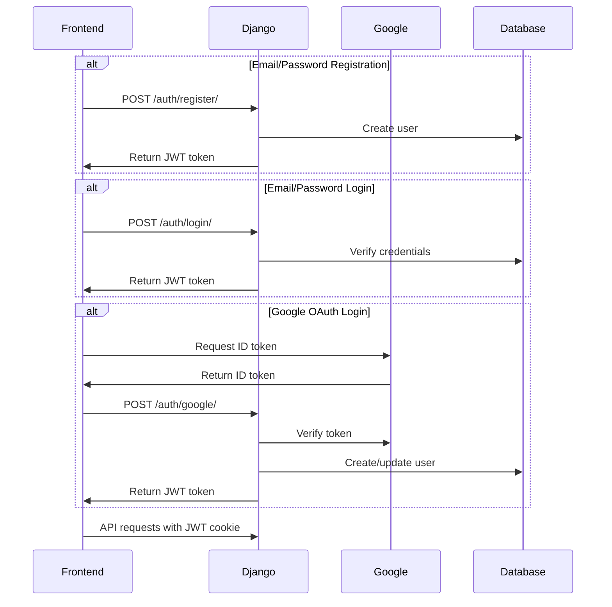

# Authentication Guide

This document details the authentication and authorization system used in SportsHunt, which uses native Django authentication with email/password and Google OAuth capabilities.

## 🔐 Overview

SportsHunt uses a modern authentication approach:
- **Native Django Authentication** for email/password login
- **Google OAuth** for social authentication
- **JWT tokens** for API authorization
- **No third-party auth services** (Auth0 removed)

## 🏗️ Authentication Architecture



## ⚙️ Configuration

### Google OAuth Setup

1. **Create Google Cloud Project**
   - Go to [Google Cloud Console](https://console.cloud.google.com/)
   - Create new project or select existing one
   - Enable Google+ API

2. **Create OAuth 2.0 Credentials**
   - Navigate to "Credentials" section
   - Create OAuth 2.0 Client ID
   - Application type: Web application
   - Authorized JavaScript origins: `http://localhost:3000`, `https://yourdomain.com`
   - Authorized redirect URIs: Not needed for ID token flow

3. **Configure Environment Variables**
   ```bash
   GOOGLE_CLIENT_ID=your-google-client-id.apps.googleusercontent.com
   GOOGLE_CLIENT_SECRET=your-google-client-secret
   JWT_SECRET=your-secret-key-here
   FRONTEND_URL=http://localhost:3000
   ```

### Django Settings

```python
# sportshunt/conf/common.py

AUTHENTICATION_BACKENDS = [
    'django.contrib.auth.backends.ModelBackend',
]

AUTH_USER_MODEL = "coreApi.User"
```

```python
# sportshunt/conf/dev.py

GOOGLE_CLIENT_ID = os.environ.get('GOOGLE_CLIENT_ID')
GOOGLE_CLIENT_SECRET = os.environ.get('GOOGLE_CLIENT_SECRET')
JWT_SECRET = os.environ.get('JWT_SECRET')

# Email backend for development
EMAIL_BACKEND = 'django.core.mail.backends.console.EmailBackend'
```

## 🔑 JWT Token Management

### Token Generation

JWT tokens are generated after successful authentication (registration, login, or Google OAuth):

```python
# JWT payload structure
payload = {
    'user_id': user.id,
    'exp': datetime.now() + timedelta(days=30)  # 30-day expiration
}
token = jwt.encode(payload, settings.JWT_SECRET, algorithm='HS256')
```

### Token Storage

Tokens are stored as HTTP-only cookies for security:

```python
response.set_cookie(
    'jwt_token',
    token,
    httponly=True,      # Prevents JavaScript access
    secure=True,        # HTTPS only
    samesite='None',    # Cross-site requests allowed
    max_age=30*24*60*60 # 30 days
)
```

### Token Validation

The `login_required_api` decorator validates tokens:

```python
from sportshunt.utils import login_required_api

@api_view(['GET'])
@login_required_api
def profile_api(request):
    # request.user is automatically populated
    return Response({'username': request.user.username})
```

## 👥 User Roles and Permissions

### User Model

```python
# coreApi/models.py

class User(AbstractUser):
    is_organizer = models.BooleanField('organizer status', default=False)
    
    def __str__(self):
        return f"{self.username}"
```

### Permission Decorators

```python
from sportshunt.utils import organizer_required_api

@api_view(['POST'])
@organizer_required_api
def create_tournament(request):
    # Only organizers can access
    pass
```

The `organizer_required_api` decorator:
- Validates JWT token
- Checks `is_organizer` status
- Verifies tournament/category ownership when applicable

## 🌐 API Endpoints

### Registration
```http
POST /auth/register/
Content-Type: application/json

{
    "email": "user@example.com",
    "username": "johndoe",
    "password": "SecurePass123!",
    "password_confirm": "SecurePass123!"
}

Response (201 Created):
{
    "message": "Registration successful",
    "user": {
        "id": 1,
        "username": "johndoe",
        "email": "user@example.com",
        "is_organizer": false
    }
}
```

Password requirements:
- Minimum 8 characters
- Cannot be too similar to username/email
- Cannot be commonly used password
- Cannot be entirely numeric

### Login
```http
POST /auth/login/
Content-Type: application/json

{
    "email": "user@example.com",
    "password": "SecurePass123!"
}

Response (200 OK):
{
    "message": "Login successful",
    "user": {
        "id": 1,
        "username": "johndoe",
        "email": "user@example.com",
        "is_organizer": false
    }
}
```

### Google OAuth
```http
POST /auth/google/
Content-Type: application/json

{
    "credential": "google-id-token-here"
}

Response (200 OK):
{
    "message": "Google authentication successful",
    "user": {
        "id": 2,
        "username": "googleuser",
        "email": "googleuser@example.com",
        "is_organizer": false
    }
}
```

The credential is obtained from Google Sign-In on the frontend:
```javascript
// Frontend example
google.accounts.id.initialize({
    client_id: 'YOUR_GOOGLE_CLIENT_ID',
    callback: handleCredentialResponse
});

function handleCredentialResponse(response) {
    // response.credential is the ID token
    fetch('/auth/google/', {
        method: 'POST',
        headers: {'Content-Type': 'application/json'},
        body: JSON.stringify({credential: response.credential})
    });
}
```

### Check Authentication Status
```http
GET /auth/check/

Response (200 OK):
{
    "isAuthenticated": true,
    "user": {
        "id": 1,
        "name": "johndoe",
        "email": "user@example.com",
        "is_org": false
    }
}

Or if not authenticated:
{
    "isAuthenticated": false
}
```

### Logout
```http
GET /logout/

Response: 
Redirects to frontend URL with JWT cookie cleared
```

## 🔒 Security Best Practices

### Password Security
- Django's built-in password hashing (PBKDF2)
- Password validation rules enforced
- Passwords never stored in plain text

### Token Security
- JWT tokens stored in HTTP-only cookies
- 30-day expiration period
- Secure flag enabled in production (HTTPS only)
- SameSite=None for cross-origin requests

### CORS Configuration
```python
# Secure CORS settings
CORS_ALLOWED_ORIGINS = [
    "https://yourfrontend.com",
    "http://localhost:3000",  # Development only
]

CORS_ALLOW_CREDENTIALS = True
```

### Google OAuth Security
- Token verification using Google's official libraries
- Issuer validation (accounts.google.com)
- Client ID verification
- Email verification check

## 🧪 Testing Authentication

### Test User Creation
```python
from coreApi.models import User

# Create test user
user = User.objects.create_user(
    username='testuser',
    email='test@example.com',
    password='TestPass123!'
)
```

### Test Authentication Endpoints
```python
from django.test import TestCase, Client

class AuthTestCase(TestCase):
    def test_registration(self):
        response = self.client.post('/auth/register/', {
            'email': 'new@example.com',
            'username': 'newuser',
            'password': 'SecurePass123!',
            'password_confirm': 'SecurePass123!'
        }, content_type='application/json')
        
        self.assertEqual(response.status_code, 201)
        self.assertIn('jwt_token', response.cookies)
    
    def test_login(self):
        User.objects.create_user(
            username='testuser',
            email='test@example.com',
            password='TestPass123!'
        )
        
        response = self.client.post('/auth/login/', {
            'email': 'test@example.com',
            'password': 'TestPass123!'
        }, content_type='application/json')
        
        self.assertEqual(response.status_code, 200)
```

## 🚨 Troubleshooting

### Common Issues

1. **Invalid JWT Token**
   - Token may be expired (30 days)
   - Check JWT_SECRET is consistent across environments
   - Verify cookie is being sent with requests

2. **Google OAuth Errors**
   - Verify Google Client ID is correct
   - Check that Google+ API is enabled
   - Ensure frontend origin is in authorized JavaScript origins
   - Token must be fresh (expires quickly)

3. **Permission Denied**
   - User must be authenticated (valid JWT token)
   - Check `is_organizer` status for organizer endpoints
   - Verify user owns the resource (tournament/category)

4. **Registration Errors**
   - Email already exists: Use unique email
   - Password too weak: Follow password requirements
   - Passwords don't match: Ensure password_confirm matches

### Debug Logging

```python
# Enable debug logging for auth
LOGGING = {
    'loggers': {
        'coreApi': {
            'handlers': ['console', 'file'],
            'level': 'DEBUG',
        },
        'sportshunt': {
            'handlers': ['console', 'file'],
            'level': 'DEBUG',
        },
    },
}
```

## 📱 Frontend Integration

### JavaScript Example (Vanilla)

```javascript
// Registration
async function register(email, username, password, passwordConfirm) {
    const response = await fetch('/auth/register/', {
        method: 'POST',
        headers: {'Content-Type': 'application/json'},
        credentials: 'include',  // Include cookies
        body: JSON.stringify({
            email, username, password, 
            password_confirm: passwordConfirm
        })
    });
    
    if (response.ok) {
        const data = await response.json();
        console.log('Registered:', data.user);
    }
}

// Login
async function login(email, password) {
    const response = await fetch('/auth/login/', {
        method: 'POST',
        headers: {'Content-Type': 'application/json'},
        credentials: 'include',
        body: JSON.stringify({email, password})
    });
    
    if (response.ok) {
        const data = await response.json();
        console.log('Logged in:', data.user);
    }
}

// Check auth status
async function checkAuth() {
    const response = await fetch('/auth/check/', {
        credentials: 'include'
    });
    
    const data = await response.json();
    return data.isAuthenticated;
}

// Logout
function logout() {
    window.location.href = '/logout/';
}
```

### React Example

```javascript
// authContext.js
import { createContext, useState, useEffect } from 'react';

export const AuthContext = createContext();

export function AuthProvider({ children }) {
    const [user, setUser] = useState(null);
    const [loading, setLoading] = useState(true);
    
    useEffect(() => {
        checkAuth();
    }, []);
    
    async function checkAuth() {
        const response = await fetch('/auth/check/', {
            credentials: 'include'
        });
        const data = await response.json();
        
        if (data.isAuthenticated) {
            setUser(data.user);
        }
        setLoading(false);
    }
    
    async function login(email, password) {
        const response = await fetch('/auth/login/', {
            method: 'POST',
            headers: {'Content-Type': 'application/json'},
            credentials: 'include',
            body: JSON.stringify({email, password})
        });
        
        if (response.ok) {
            const data = await response.json();
            setUser(data.user);
            return { success: true };
        }
        
        return { success: false, error: 'Invalid credentials' };
    }
    
    return (
        <AuthContext.Provider value={{ user, login, checkAuth, loading }}>
            {children}
        </AuthContext.Provider>
    );
}
```

### Axios Configuration

```javascript
import axios from 'axios';

// Create axios instance with default config
const api = axios.create({
    baseURL: 'http://localhost:8000',
    withCredentials: true,  // Send cookies with requests
    headers: {
        'Content-Type': 'application/json'
    }
});

// Use the instance
api.post('/auth/login/', {email, password})
    .then(response => console.log(response.data));
```

## 🔮 Future Enhancements

### Password Reset (Planned)

The email configuration is prepared for future password reset implementation:

```python
# Production email settings (configure for password reset)
EMAIL_BACKEND = 'django.core.mail.backends.smtp.EmailBackend'
EMAIL_HOST = os.environ.get('EMAIL_HOST')
EMAIL_PORT = os.environ.get('EMAIL_PORT', 587)
EMAIL_USE_TLS = True
EMAIL_HOST_USER = os.environ.get('EMAIL_HOST_USER')
EMAIL_HOST_PASSWORD = os.environ.get('EMAIL_HOST_PASSWORD')
```

Future endpoints will include:
- `POST /auth/password-reset/` - Request password reset
- `POST /auth/password-reset/confirm/` - Confirm with token

### Email Verification (Planned)

Optional email verification can be implemented:
- Send verification email on registration
- Verify email with token
- Add `email_verified` field to User model

---

For more information, see:
- [Django Authentication System](https://docs.djangoproject.com/en/5.1/topics/auth/)
- [Google Sign-In for Websites](https://developers.google.com/identity/gsi/web)
- [JWT Best Practices](https://datatracker.ietf.org/doc/html/rfc8725)
