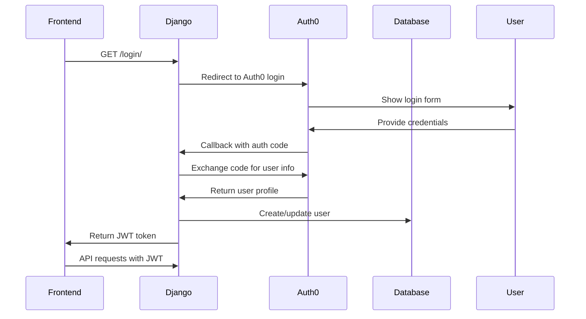

# Authentication Guide

This document details the authentication and authorization system used in SportsHunt, which integrates Auth0 for secure user management.

## 🔐 Overview

SportsHunt uses a hybrid authentication approach:
- **Auth0** for user authentication (OAuth 2.0)
- **JWT tokens** for API authorization
- **Django sessions** for web interface (admin)

## 🏗️ Authentication Architecture



## ⚙️ Auth0 Configuration

### Auth0 Application Setup

1. **Create Auth0 Application**
   - Type: Regular Web Application
   - Allowed Callback URLs: `http://localhost:8000/login/handler/`, `https://yourdomain.com/login/handler/`
   - Allowed Logout URLs: `http://localhost:8000/`, `https://yourdomain.com/`

2. **Social Connections**
   - Enable Google, Facebook, or other providers as needed
   - Configure social login settings

3. **Rules/Actions**
   ```javascript
   // Example Auth0 Rule to add custom claims
   function addCustomClaims(user, context, callback) {
     const namespace = 'https://sportshunt.com/';
     context.idToken[namespace + 'user_metadata'] = user.user_metadata;
     context.idToken[namespace + 'app_metadata'] = user.app_metadata;
     callback(null, user, context);
   }
   ```

### Django Settings Configuration

```python
# settings/common.py

# Auth0 Configuration
SOCIAL_AUTH_AUTH0_DOMAIN = env('SOCIAL_AUTH_AUTH0_DOMAIN')
SOCIAL_AUTH_AUTH0_KEY = env('SOCIAL_AUTH_AUTH0_KEY')
SOCIAL_AUTH_AUTH0_SECRET = env('SOCIAL_AUTH_AUTH0_SECRET')

# Social Auth Pipeline
SOCIAL_AUTH_PIPELINE = (
    'social_core.pipeline.social_auth.social_details',
    'social_core.pipeline.social_auth.social_uid',
    'social_core.pipeline.social_auth.social_user',
    'social_core.pipeline.user.get_username',
    'social_core.pipeline.user.create_user',
    'social_core.pipeline.social_auth.associate_user',
    'social_core.pipeline.social_auth.load_extra_data',
    'social_core.pipeline.user.user_details',
)

# JWT Configuration
SIMPLE_JWT = {
    'ACCESS_TOKEN_LIFETIME': timedelta(hours=24),
    'REFRESH_TOKEN_LIFETIME': timedelta(days=7),
    'ROTATE_REFRESH_TOKENS': True,
}
```

## 🔑 JWT Token Management

### Token Generation

```python
# sportshunt/utils/authentication.py

from rest_framework_simplejwt.tokens import RefreshToken

def generate_jwt_tokens(user):
    """Generate JWT access and refresh tokens for a user."""
    refresh = RefreshToken.for_user(user)
    return {
        'access': str(refresh.access_token),
        'refresh': str(refresh),
    }
```

### Token Validation

```python
# Custom JWT Authentication
class CustomJWTAuthentication(JWTAuthentication):
    def get_user(self, validated_token):
        try:
            user_id = validated_token['user_id']
            user = User.objects.get(id=user_id)
            return user
        except User.DoesNotExist:
            return None
```

## 👥 User Roles and Permissions

### User Model

```python
# coreApi/models.py

class User(AbstractUser):
    is_organizer = models.BooleanField('organizer status', default=False)
    
    def __str__(self):
        return f"{self.username}"
```

### Permission Decorators

```python
# sportshunt/utils/authentication.py

def organizer_required_api(view_func):
    """Decorator to require organizer status for API views."""
    @wraps(view_func)
    def wrapper(request, *args, **kwargs):
        if not request.user.is_authenticated:
            return JsonResponse({'error': 'Authentication required'}, status=401)
        
        if not request.user.is_organizer:
            return JsonResponse({'error': 'Organizer access required'}, status=403)
        
        return view_func(request, *args, **kwargs)
    return wrapper
```

## 🌐 API Authentication

### Making Authenticated Requests

```javascript
// Frontend example
const token = localStorage.getItem('access_token');

fetch('/api/profile/', {
    headers: {
        'Authorization': `Bearer ${token}`,
        'Content-Type': 'application/json',
    }
})
```

### Authentication Endpoints

#### Check Authentication Status
```http
GET /auth/check/
Authorization: Bearer <jwt_token>

Response:
{
    "isAuthenticated": true,
    "user": {
        "id": 1,
        "username": "john_doe",
        "email": "john@example.com",
        "is_organizer": false
    }
}
```

#### Login Flow
```http
GET /login/
# Redirects to Auth0

GET /login/handler/
# Auth0 callback - returns JWT tokens
```

#### Logout
```http
GET /logout/
# Clears session and redirects to Auth0 logout
```

## 🔒 Security Best Practices

### Token Security
- Store JWT tokens securely (httpOnly cookies recommended)
- Implement token refresh logic
- Use HTTPS in production
- Set appropriate token expiration times

### CORS Configuration
```python
# Secure CORS settings
CORS_ALLOWED_ORIGINS = [
    "https://yourfrontend.com",
    "http://localhost:3000",  # Development only
]

CORS_ALLOW_CREDENTIALS = True
```

### Rate Limiting
```python
# Add rate limiting for auth endpoints
from django_ratelimit.decorators import ratelimit

@ratelimit(key='ip', rate='5/m', method='POST')
def login_view(request):
    # Login logic
    pass
```

## 🧪 Testing Authentication

### Test Setup
```python
# tests/test_auth.py

class AuthTestCase(TestCase):
    def setUp(self):
        self.user = User.objects.create_user(
            username='testuser',
            email='test@example.com',
            is_organizer=True
        )
        
    def test_jwt_token_generation(self):
        tokens = generate_jwt_tokens(self.user)
        self.assertIn('access', tokens)
        self.assertIn('refresh', tokens)
```

### Mock Auth0 in Tests
```python
from unittest.mock import patch

@patch('social_django.utils.load_strategy')
def test_auth0_callback(self, mock_strategy):
    # Mock Auth0 response
    response = self.client.get('/login/handler/')
    self.assertEqual(response.status_code, 200)
```

## 🚨 Troubleshooting

### Common Issues

1. **Invalid JWT Token**
   ```python
   # Check token expiration
   from django.utils import timezone
   if token.exp < timezone.now():
       # Token expired, refresh needed
   ```

2. **Auth0 Callback Errors**
   - Verify callback URLs in Auth0 dashboard
   - Check Auth0 credentials in environment variables
   - Ensure social auth middleware is enabled

3. **Permission Denied**
   - Verify user has required permissions
   - Check organizer status for organization endpoints

### Debug Settings
```python
# Enable debug logging for auth
LOGGING = {
    'loggers': {
        'social_django': {
            'handlers': ['console'],
            'level': 'DEBUG',
        },
    },
}
```

## 📱 Frontend Integration

### React Example
```javascript
// auth.js
class AuthService {
    login() {
        window.location.href = '/login/';
    }
    
    logout() {
        localStorage.removeItem('access_token');
        window.location.href = '/logout/';
    }
    
    getToken() {
        return localStorage.getItem('access_token');
    }
    
    isAuthenticated() {
        const token = this.getToken();
        return token && !this.isTokenExpired(token);
    }
}
```

### Axios Interceptor
```javascript
// Add token to all requests
axios.interceptors.request.use(config => {
    const token = AuthService.getToken();
    if (token) {
        config.headers.Authorization = `Bearer ${token}`;
    }
    return config;
});
```

---

For more information, see:
- [Django Social Auth Documentation](https://python-social-auth.readthedocs.io/)
- [Auth0 Django Integration](https://auth0.com/docs/quickstart/webapp/django)
- [JWT Best Practices](https://auth0.com/blog/a-look-at-the-latest-draft-for-jwt-bcp/)
