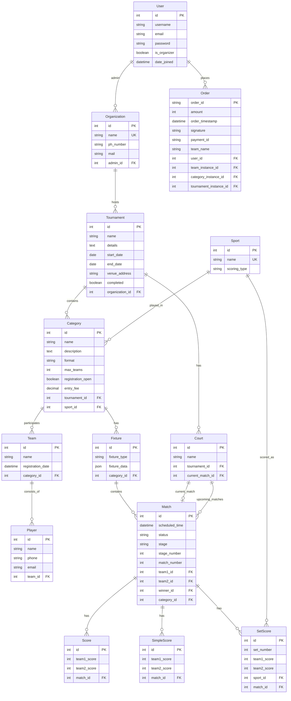

# Database Schema

This document describes the database schema and model relationships in the SportsHunt system.

## 📊 Entity Relationship Diagram



## 🏗️ Core Models

### User Model
```python
class User(AbstractUser):
    is_organizer = models.BooleanField('organizer status', default=False)
```

**Purpose**: Extended Django user model with organizer permissions
**Key Fields**:
- `is_organizer`: Boolean flag for tournament organizer access
- Inherits: `username`, `email`, `password`, `date_joined`, etc.

### Organization Model
```python
class Organization(models.Model):
    name = models.CharField(max_length=255, unique=True)
    ph_number = models.CharField(max_length=10, validators=[phone_regex])
    mail = models.EmailField(max_length=255)
    admin = models.ForeignKey(User, on_delete=models.CASCADE, related_name="organization")
```

**Purpose**: Represents tournament organizing entities
**Business Rules**:
- Each user can admin only one organization
- Organization names must be unique
- Phone number must be exactly 10 digits

### Sport Model
```python
class Sport(models.Model):
    SCORING_TYPES = [
        ('sets', 'Set-based scoring'),
        ('simple', 'Simple score'),
    ]
    
    name = models.CharField(max_length=20, unique=True)
    scoring_type = models.CharField(max_length=10, choices=SCORING_TYPES)
```

**Purpose**: Defines sports and their scoring systems
**Scoring Types**:
- `simple`: Direct point-based scoring (e.g., football: 2-1)
- `sets`: Set-based scoring (e.g., tennis: 6-4, 7-5)

### Tournament Model
```python
class Tournament(models.Model):
    name = models.CharField(max_length=255)
    details = models.TextField()
    organization = models.ForeignKey(Organization, on_delete=models.CASCADE)
    start_date = models.DateField()
    end_date = models.DateField()
    venue_address = models.TextField()
    completed = models.BooleanField(default=False)
```

**Purpose**: Main tournament container
**Validation**: `end_date` must be after `start_date`
**Status**: `completed` flag marks finished tournaments

### Court Model ✅ NEW
```python
class Court(models.Model):
    name = models.CharField(max_length=255)
    tournament = models.ForeignKey(Tournament, on_delete=models.CASCADE, related_name='courts')
    current_match = models.ForeignKey('Match', on_delete=models.SET_NULL, null=True, blank=True, related_name='current_court')
    upcoming_matches = models.ManyToManyField('Match', related_name='upcoming_courts', blank=True)

    def advance_to_next_match(self):
        """Advance court to next match in queue"""
        next_matches = self.upcoming_matches.order_by('id')
        if next_matches.exists():
            next_match = next_matches.first()
            self.current_match = next_match
            self.upcoming_matches.remove(next_match)
        else:
            self.current_match = None
        self.save()
```

**Purpose**: Physical court/venue management within tournaments
**Features**:
- **Tournament Scoped**: Each court belongs to a specific tournament
- **Current Match**: Tracks the match currently being played
- **Queue Management**: Manages upcoming matches via `upcoming_matches` ManyToMany
- **Auto-Advancement**: `advance_to_next_match()` method handles queue progression
- **Unique Names**: Court names must be unique within each tournament

**Key Relationships**:
- `tournament`: ForeignKey to Tournament (CASCADE delete)
- `current_match`: ForeignKey to Match (SET_NULL on delete)
- `upcoming_matches`: ManyToManyField with Match model

**Usage Examples**:
- Court status tracking (available/occupied)
- Automatic match progression on completion
- Queue position management
- Real-time court utilization monitoring

### Category Model
```python
class Category(models.Model):
    FORMAT_CHOICES = [
        ('KO', 'Knockout'),
        ('RR', 'Round Robin'),
        ('MIXED', 'Mixed'),
    ]
    
    name = models.CharField(max_length=100)
    description = models.TextField(blank=True)
    format = models.CharField(max_length=10, choices=FORMAT_CHOICES)
    max_teams = models.PositiveIntegerField()
    registration_open = models.BooleanField(default=True)
    entry_fee = models.DecimalField(max_digits=10, decimal_places=2, default=0.00)
    tournament = models.ForeignKey(Tournament, on_delete=models.CASCADE)
    sport = models.ForeignKey(Sport, on_delete=models.CASCADE)
```

**Purpose**: Tournament divisions (e.g., "Men's Singles", "Women's Doubles")
**Formats**:
- `KO`: Single/double elimination
- `RR`: Round robin (everyone plays everyone)
- `MIXED`: Combination format

### Team Model
```python
class Team(models.Model):
    name = models.CharField(max_length=100)
    registration_date = models.DateTimeField(auto_now_add=True)
    category = models.ForeignKey(Category, on_delete=models.CASCADE)
```

**Purpose**: Participating teams in categories
**Note**: Team names are scoped to categories (same name can exist in different categories)

### Player Model
```python
class Player(models.Model):
    name = models.CharField(max_length=100)
    phone = models.CharField(max_length=10, validators=[phone_regex])
    email = models.EmailField(max_length=254, blank=True, null=True)
    team = models.ForeignKey(Team, on_delete=models.CASCADE)
```

**Purpose**: Individual players within teams
**Validation**: Phone number must be 10 digits

## 🏆 Tournament Management Models

### Fixture Model
```python
class Fixture(models.Model):
    FIXTURE_TYPES = [
        ('KO', 'Knockout'),
        ('RR', 'Round Robin'),
    ]
    
    fixture_type = models.CharField(max_length=2, choices=FIXTURE_TYPES)
    fixture_data = models.JSONField()
    category = models.OneToOneField(Category, on_delete=models.CASCADE)
```

**Purpose**: Tournament bracket/schedule container
**Storage**: `fixture_data` contains the tournament structure as JSON

### Match Model
```python
class Match(models.Model):
    STATUS_CHOICES = [
        ('scheduled', 'Scheduled'),
        ('in_progress', 'In Progress'),
        ('completed', 'Completed'),
        ('cancelled', 'Cancelled'),
    ]
    
    scheduled_time = models.DateTimeField(blank=True, null=True)
    status = models.CharField(max_length=12, choices=STATUS_CHOICES, default='scheduled')
    stage = models.CharField(max_length=50, blank=True, null=True)
    stage_number = models.PositiveIntegerField()
    match_number = models.PositiveIntegerField()
    team1 = models.ForeignKey(Team, on_delete=models.CASCADE, related_name='matches_as_team1')
    team2 = models.ForeignKey(Team, on_delete=models.CASCADE, related_name='matches_as_team2')
    winner = models.ForeignKey(Team, on_delete=models.SET_NULL, null=True, blank=True)
    category = models.ForeignKey(Category, on_delete=models.CASCADE)
```

**Purpose**: Individual matches within tournaments
**Stages**: Final, Semi-Final, Quarter-Final, etc.
**Numbers**: Used for bracket positioning and ordering

## 📊 Scoring Models

### Simple Score Model
```python
class SimpleScore(models.Model):
    team1_score = models.PositiveIntegerField()
    team2_score = models.PositiveIntegerField()
    match = models.OneToOneField(Match, on_delete=models.CASCADE)
```

**Purpose**: Basic point-based scoring
**Example**: Football (2-1), Basketball (85-78)

### Set Score Model
```python
class SetScore(models.Model):
    set_number = models.PositiveIntegerField()
    team1_score = models.PositiveIntegerField()
    team2_score = models.PositiveIntegerField()
    sport = models.ForeignKey(Sport, on_delete=models.CASCADE)
    match = models.ForeignKey(Match, on_delete=models.CASCADE)
```

**Purpose**: Set-based scoring systems
**Example**: Tennis (6-4, 6-3), Volleyball (25-20, 25-22, 15-25)

## 💰 Payment Models

### Order Model
```python
class Order(models.Model):
    order_id = models.CharField(max_length=100, primary_key=True)
    user = models.ForeignKey(User, on_delete=models.CASCADE)
    amount = models.IntegerField()
    order_timestamp = models.DateTimeField(auto_now_add=True)
    signature = models.CharField(max_length=255, blank=True, null=True)
    payment_id = models.CharField(max_length=100, blank=True, null=True)
    team_instance = models.ForeignKey(Team, on_delete=models.CASCADE, blank=True, null=True)
    team_name = models.CharField(max_length=100)
    category_instance = models.ForeignKey(Category, on_delete=models.CASCADE, blank=True, null=True)
    tournament_instance = models.ForeignKey(Tournament, on_delete=models.CASCADE, blank=True, null=True)
```

**Purpose**: Payment tracking for tournament registrations
**Integration**: Prepared for payment gateway integration
**References**: Links to tournament, category, and team for registration context

## 🔐 Data Access Patterns

### Organizer Access Control
```python
# Check if user can access tournament
def can_access_tournament(user, tournament):
    if not user.is_organizer:
        return False
    return tournament.organization.admin == user
```

### Tournament Data Fetching
```python
# Efficient tournament details query
tournament = Tournament.objects.select_related('organization').get(id=tournament_id)
categories = tournament.categories.select_related('sport').prefetch_related('teams')
```

### Match Scoring Queries
```python
# Get match with scores
match = Match.objects.select_related('team1', 'team2', 'winner').get(id=match_id)

# Check scoring type and get appropriate scores
if match.category.sport.scoring_type == 'simple':
    score = match.simplescore
else:
    scores = match.setscore_set.all().order_by('set_number')
```

## 📈 Performance Considerations

### Database Indexes
```python
# Recommended indexes for common queries
class Meta:
    indexes = [
        models.Index(fields=['tournament', 'registration_open']),  # Category
        models.Index(fields=['category', 'stage_number']),        # Match
        models.Index(fields=['start_date', 'completed']),         # Tournament
    ]
```

### Query Optimization
- Use `select_related()` for foreign key relationships
- Use `prefetch_related()` for many-to-many and reverse foreign keys
- Implement pagination for large result sets
- Cache frequently accessed data (tournament lists, etc.)

## 🧪 Test Data

### Sample Data Creation
```python
# Create test tournament hierarchy
organization = Organization.objects.create(
    name="Test Sports Club",
    admin=user,
    mail="test@example.com",
    ph_number="1234567890"
)

tournament = Tournament.objects.create(
    name="Summer Championship",
    organization=organization,
    start_date=date.today(),
    end_date=date.today() + timedelta(days=7)
)

category = Category.objects.create(
    name="Men's Singles",
    tournament=tournament,
    sport=tennis_sport,
    format='KO',
    max_teams=16
)
```

## 🔄 Data Migration Notes

### Common Migrations
- Adding new sports: Update `Sport` model and create migration
- Changing scoring types: Data migration required for existing scores
- Tournament format changes: May require fixture data restructuring

### Migration Scripts
```python
# Example: Add new sport
def add_badminton_sport(apps, schema_editor):
    Sport = apps.get_model('organizationApi', 'Sport')
    Sport.objects.create(name='Badminton', scoring_type='sets')
```

---

This schema supports flexible tournament management while maintaining data integrity and performance. The design allows for future extensions like team rankings, player statistics, and advanced tournament formats.
